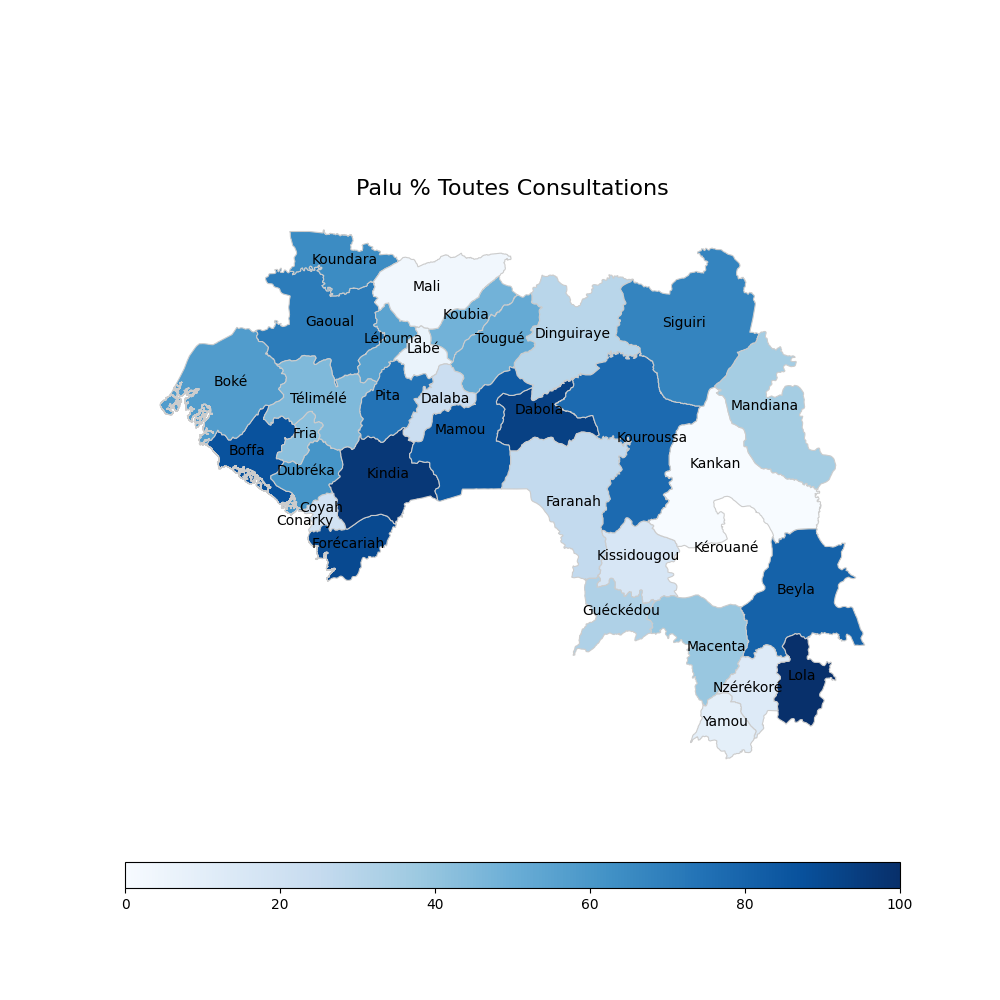

# Overview
This server will take in a json object for for district level data in Guinea and return a PNG image 

## Getting Started
1. pip install -r requirements.txt
1. python app.py

## End points
/positivity_rate.png

/confirmation_rate.png

/incidence.png

/population.png

## And here is what the output looks like

curl -H "Content-Type: application/json" "http://guinea-malaria-maps.herokuapp.com/consultations.png" --data @static/example.json
